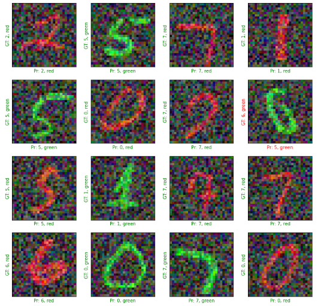

# MultiTaskModel
In this Project, we use no. of grey-scale handwritten digits' images and generate colored training and validation images.
In the process of generating colored images, We use the pixel values of old grey-scale image to decide either red-channel or green-channel pixel values of
new image and always set blue-channel pixel values to zero(*Red channel or Green channel are chosen randomly*).

Thus generated images train the convolution neural network model (`using keras functional API`) with skip connections that gives 2 output: `multiclass digit output` and
`binary class color output`.

The trained model has the 100% accuracy for color(with both datasets) and 98% accuracy digit accuracy for validation dataset and 97% digit accuracy for training dataset.

